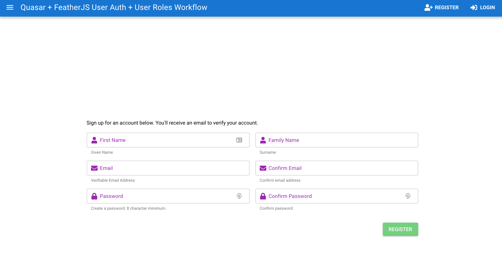
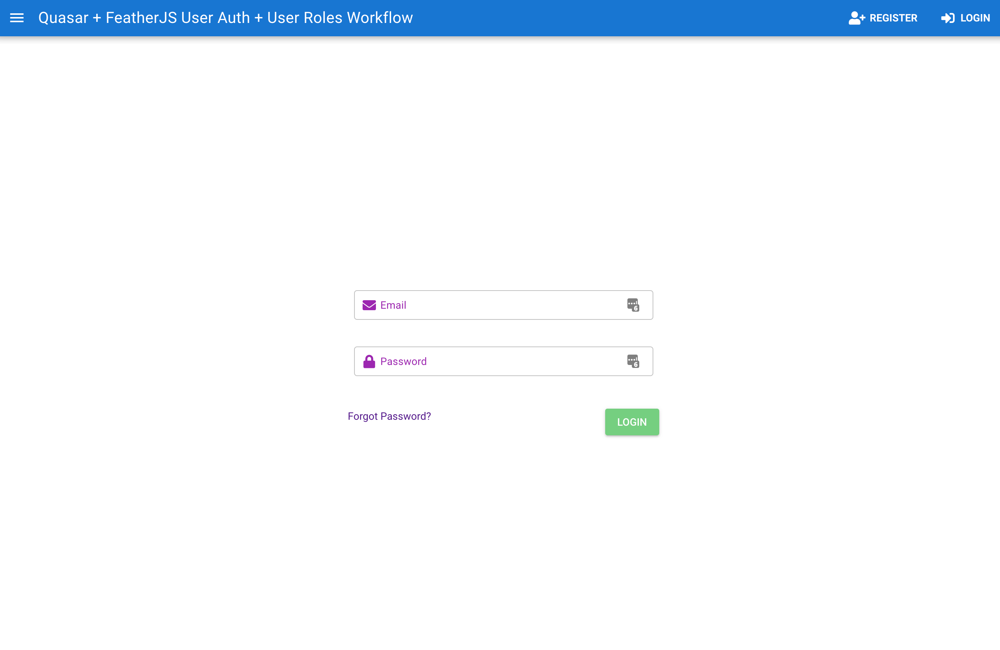
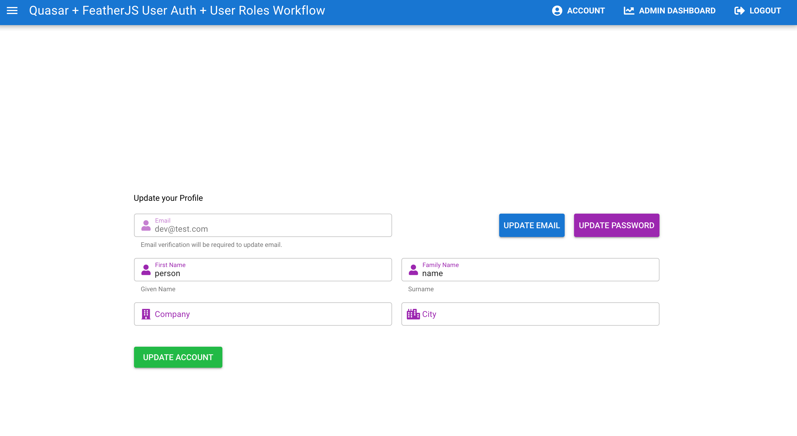
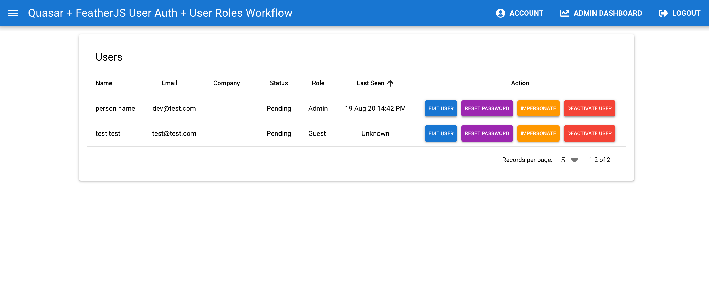

## Basic User Management and Roles System

### Background

There's two primary types of MVP markets - B2C and B2B.

This starter is aimed at B2B markets, including a user account creation workflow implementing [feathers-authentication-management](https://github.com/feathers-plus/feathers-authentication-management) library for [FeathersJS](https://feathersjs.com/) with AWS SES as the mailer and MongoDB as the datastore.

The frontend is built with [Quasar](https://quasar.dev), a [Vue.js](https://vuejs.org) based component framework.

### Functionality

- Register User
- Login User
- Update account
- Reset/Forgot Password
- Admin User Management (update profile/role, send password reset, deactivate user)
- Logout

### Configuration

#### Quasar Frontend

The frontend is a starter. You will want to customize to your brand/color/theme. View the [Quasar Docs](https://quasar.dev) to learn more about how to add your own brand. The `boot/axios` and `boot/feathersClient` files may need to be updated based on the endpoint you are targetting.

#### FeathersJS Backend

The backend is scaffolded with Feathersjs. See the [configuration documentation](https://docs.feathersjs.com/api/configuration.html) for more information on how to configure your app. If you are forking this repo, you will want to generate a new secure secret.

### Docker

This repo can be run locally with [Docker Compose](https://docs.docker.com/compose/) using `docker-compose up`, though some configuration files may need to be updated/created to properly run locally. Alternately, you can run the `client` and `server` repos separately.

#### Client

Client can be run with the Quasar CLI using `quasar dev`. Make sure to [install the Quasar CLI](https://quasar.dev/quasar-cli/installation) first.

#### Server

Server can be run with node using `npm run dev`.

### Contribute

Feel free to improve and submit pull requests on this repo. Questions, comments and suggestions are also welcome. This is a starter repo I will be using for building out a MVP.

#### Screenshots

### Register

### Login

### Account

### Admin

